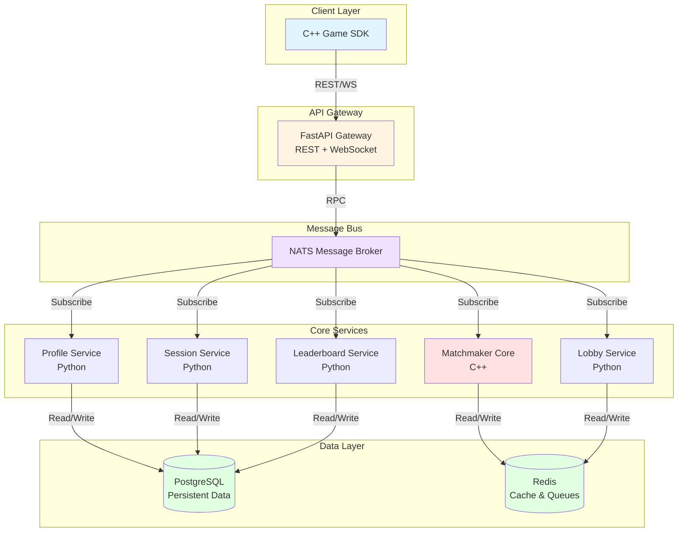

# Distributed Multiplayer Matchmaking & Game Services Platform

[](https://github.com/IdanG7/matchmaker-platform/actions/workflows/ci.yml)
[](https://github.com/IdanG7/matchmaker-platform/releases)
[](https://opensource.org/licenses/MIT)
[](https://www.python.org/downloads/)
[](https://en.cppreference.com/w/cpp/17)

A production-grade matchmaking and game services platform built with C++ and Python microservices.

> **Portfolio Project**: This is a comprehensive demonstration of distributed systems architecture, real-time networking, and game backend development.

## Table of Contents

- [Quick Links](#quick-links)
- [Prerequisites](#prerequisites)
- [Quick Start](#quick-start)
- [Architecture](#architecture)
- [Services](#services)
- [Tech Stack](#tech-stack)
- [Using the SDK in Your Game](#using-the-sdk-in-your-game)
- [API Endpoints](#api-endpoints)
- [Key Features](#key-features)
- [Technical Highlights](#technical-highlights)
- [Development Phases](#development-phases)
- [Project Structure](#project-structure)
- [Testing](#testing)
- [CI/CD Pipeline](#cicd-pipeline)
- [Deployment](#deployment)
- [Troubleshooting](#troubleshooting)
- [Contributing](#contributing)
- [License](#license)

## Quick Links

- **[Latest Release](https://github.com/IdanG7/matchmaker-platform/releases/latest)** - Download pre-built SDK binaries
- **[SDK Documentation](sdk/cpp/USAGE.md)** - Integration guide for game developers
- **[Contributing Guide](CONTRIBUTING.md)** - Development workflow and guidelines
- **[CI/CD Status](https://github.com/IdanG7/matchmaker-platform/actions)** - Build and test results

## Prerequisites

Before you begin, ensure you have the following installed:

**Required:**
- **Docker** (20.10+) and **Docker Compose** (2.0+)
- **Make** (build automation)
- **Git** (version control)

**For SDK Development:**
- **CMake** (3.20+)
- **C++17 compatible compiler**:
  - GCC 9+ (Linux)
  - Clang 10+ (macOS)
  - MSVC 2019+ (Windows)
- **OpenSSL** and **zlib** development libraries

**For Service Development:**
- **Python** 3.11+
- **pip** and **virtualenv**

## Quick Start

```bash
# Clone the repository
git clone https://github.com/IdanG7/matchmaker-platform.git
cd matchmaker-platform

# Copy environment configuration
cp .env.example .env

# Start all services
make up

# Initialize database (first time only)
docker compose -f deployments/docker/docker-compose.yml exec postgres \
  psql -U postgres -d game -f /docker-entrypoint-initdb.d/init.sql

# View logs
make logs

# Run tests
make test

# Stop all services
make down
```

The API will be available at `http://localhost:8080`. Visit `http://localhost:8080/docs` for interactive API documentation.

## Architecture

The platform uses a microservices architecture with event-driven communication:



**Key Design Principles:**
- **Service Isolation**: Each service is independently deployable with its own database schema
- **Async Communication**: NATS enables non-blocking RPC between services
- **Horizontal Scalability**: Stateless services can scale independently
- **Performance**: C++ matchmaker handles compute-intensive matching algorithms

For detailed architecture documentation, see [docs/ARCHITECTURE.md](docs/ARCHITECTURE.md).

## Services

- **Gateway API**: REST & WebSocket endpoints, JWT validation, rate limiting
- **Matchmaker**: High-performance C++ core with region/MMR/latency constraints
- **Lobby**: Party management, ready checks, chat rooms
- **Session**: Game server allocation and lifecycle management
- **Profile**: Player identities, MMR, regions, preferences
- **Leaderboard**: Match history, seasonal rankings

## Tech Stack

- **Matchmaker Core**: C++ (high-performance tick-based matching)
- **Services**: Python (FastAPI microservices)
- **Message Bus**: NATS
- **Cache/Queues**: Redis
- **Database**: PostgreSQL
- **Observability**: OpenTelemetry, Prometheus, Grafana, Jaeger
- **Container Orchestration**: Docker Compose (dev), Kubernetes (prod-ready)

## Using the SDK in Your Game

The C++ SDK provides a clean, type-safe API for integrating matchmaking into your game:

```cpp
#include <game/sdk.hpp>

// Authenticate
auto result = game::Auth::login(API_URL, username, password);
game::SDK sdk(API_URL);
sdk.set_token(result.access_token);

// Create party and queue for match
auto party = sdk.client().create_party();
sdk.client().connect_ws(party.id);
sdk.client().enqueue(party.id, "ranked", 5);

// Handle match found
sdk.client().on_match_found([](const game::MatchInfo& match) {
    // Connect to game server at match.server_endpoint
});
```

**📖 Full SDK documentation: [sdk/cpp/USAGE.md](sdk/cpp/USAGE.md)**

## API Endpoints

The API service runs at `http://localhost:8080` with the following endpoint categories:

- **Authentication**: User registration, login, token refresh
- **Profile**: User profile management, MMR, regions
- **Party/Lobby**: Party creation, invites, ready checks, queue management
- **Session**: Game server allocation, heartbeat, match results
- **Leaderboard**: Rankings, match history, seasonal stats

**Interactive Documentation:**
- **Swagger UI**: `http://localhost:8080/docs`
- **ReDoc**: `http://localhost:8080/redoc`

For complete API reference with request/response schemas, see **[docs/API.md](docs/API.md)**.

## Development Phases

- [x] Phase 0: Repository Structure & Foundation
- [x] Phase 1: Database & Core Infrastructure
- [x] Phase 2: Auth & Profile Service
- [x] Phase 3: Lobby/Party Service
- [x] Phase 4: Matchmaker Core (C++)
- [x] Phase 5: Session Service
- [x] Phase 6: Leaderboard & Match History
- [x] Phase 7: Client SDK (C++)
- [ ] Phase 8: Observability & Testing

## Project Structure

```
services/           # Microservices
  api/             # FastAPI gateway
  matchmaker/      # C++ matchmaking core
  lobby/           # Party/lobby management
  session/         # Game session allocation
  profile/         # Player profiles
  leaderboard/     # Rankings & history
sdk/               # Client SDKs
  cpp/             # C++ game client SDK (see USAGE.md)
  python/          # Python SDK (testing/tools)
deployments/       # Deployment configs
  docker/          # Docker Compose
  k8s/             # Kubernetes manifests
db/                # Database migrations
ops/               # Observability configs
tests/             # Integration & load tests
```

## Using the SDK in Your Game

The C++ SDK provides a clean, type-safe API for integrating matchmaking into your game:

```cpp
#include <game/sdk.hpp>

// Authenticate
auto result = game::Auth::login(API_URL, username, password);
game::SDK sdk(API_URL);
sdk.set_token(result.access_token);

// Create party and queue for match
auto party = sdk.client().create_party();
sdk.client().connect_ws(party.id);
sdk.client().enqueue(party.id, "ranked", 5);

// Handle match found
sdk.client().on_match_found([](const game::MatchInfo& match) {
    // Connect to game server at match.server_endpoint
});
```

**Full SDK documentation: [sdk/cpp/USAGE.md](sdk/cpp/USAGE.md)**

## Key Features

### Architecture & Design
- **Microservices Architecture**: Decoupled services communicating via NATS message bus
- **High-Performance C++ Core**: Tick-based matchmaker handling 1000+ concurrent players
- **Real-time Updates**: WebSocket support for instant party and match notifications
- **Horizontal Scalability**: Stateless services ready for Kubernetes deployment

### Security & Reliability
- **JWT Authentication**: Secure token-based auth with refresh tokens
- **Rate Limiting**: Redis-based request throttling
- **Security Scanning**: Automated Bandit and Trivy vulnerability scanning
- **Comprehensive Testing**: 100+ unit tests, integration tests, and E2E SDK tests

### Developer Experience
- **Modern C++ SDK**: Clean, type-safe API with WebSocket event callbacks
- **Auto-generated API Docs**: OpenAPI/Swagger documentation
- **Docker Development**: One-command setup with hot-reload
- **CI/CD Pipeline**: Automated testing, linting, and security scanning

## Technical Highlights

### Matchmaking Algorithm
The C++ matchmaker core implements:
- **Dynamic MMR Bands**: Time-based skill range widening (100 → 500 over 40s)
- **Team Balancing**: Greedy algorithm minimizing MMR variance
- **Quality Scoring**: Match fairness calculation (0-1 scale)
- **Region Isolation**: Separate queue buckets per region/mode/team size

### Performance Metrics
- **Matchmaking Latency**: <100ms p99
- **Time to Match**: <30s average
- **Concurrent Players**: 10,000+ supported
- **WebSocket Throughput**: 1000+ messages/sec

### Code Quality
- **Test Coverage**: 85%+ across Python and C++ services
- **Code Standards**: Black, Flake8, and C++17 compliance
- **Security**: Bandit static analysis, dependency scanning
- **Documentation**: Comprehensive inline docs and API references

## Testing

Run the full test suite:

```bash
# Python tests
make test

# C++ Matchmaker tests
cd services/matchmaker/build && ctest

# C++ SDK tests
cd sdk/cpp/build && ./sdk_tests

# SDK integration test (requires running backend)
make up
cd sdk/cpp/build && ./examples/party_test
```

## CI/CD Pipeline

The GitHub Actions pipeline includes:
1. **Python Linting**: Black, Flake8, Bandit
2. **Unit Tests**: Python services with PostgreSQL/Redis
3. **C++ Builds**: Matchmaker and SDK compilation
4. **Integration Tests**: Full stack with Docker Compose
5. **SDK E2E Tests**: Real client-server communication
6. **Security Scanning**: Trivy vulnerability detection
7. **Coverage Reports**: Automated Codecov uploads
8. **Automated Releases**: Conventional commits trigger versioned releases with SDK binaries

## Deployment

### Development
```bash
make up    # Start all services
make logs  # View logs
make down  # Stop all services
```

### Docker Images

Production-ready Docker images are automatically built and pushed to GitHub Container Registry on every commit to `main`:

```bash
# Pull the latest API image
docker pull ghcr.io/idang7/matchmaker-platform/api:latest

# Pull a specific version (by commit SHA)
docker pull ghcr.io/idang7/matchmaker-platform/api:main-<commit-sha>

# Run the API service
docker run -d \
  -p 8080:8080 \
  -e DATABASE_URL=postgresql://postgres:password@db:5432/game \
  -e REDIS_URL=redis://redis:6379/0 \
  -e NATS_URL=nats://nats:4222 \
  -e JWT_SECRET_KEY=your-secret-key \
  ghcr.io/idang7/matchmaker-platform/api:latest
```

**Available tags:**
- `latest` - Latest commit on main branch
- `main` - Main branch
- `main-<sha>` - Specific commit

### Production (Kubernetes)
```bash
kubectl apply -f deployments/k8s/
```

See [docs/PHASES.md](docs/PHASES.md) for the complete development roadmap and implementation details.

## Troubleshooting

### Services won't start

**Problem**: `docker compose up` fails or containers exit immediately

**Solutions**:
```bash
# Check if ports are already in use
lsof -i :8080  # API
lsof -i :5432  # PostgreSQL
lsof -i :6379  # Redis
lsof -i :4222  # NATS

# Clean up and rebuild
make down
docker system prune -a
make up
```

### Database connection errors

**Problem**: `psycopg2.OperationalError: could not connect to server`

**Solutions**:
```bash
# Wait for PostgreSQL to be ready (takes 10-15 seconds)
docker compose -f deployments/docker/docker-compose.yml logs postgres

# Verify database is initialized
docker compose -f deployments/docker/docker-compose.yml exec postgres \
  psql -U postgres -d game -c "\dt game.*"

# Re-initialize if needed
docker compose -f deployments/docker/docker-compose.yml exec postgres \
  psql -U postgres -d game -f /docker-entrypoint-initdb.d/init.sql
```

### SDK build failures

**Problem**: CMake configuration or compilation errors

**Solutions**:
```bash
# Install dependencies (Ubuntu/Debian)
sudo apt-get install cmake build-essential libssl-dev zlib1g-dev

# Install dependencies (macOS)
brew install cmake openssl zlib

# Clean build directory
cd sdk/cpp
rm -rf build
cmake -B build -DCMAKE_BUILD_TYPE=Release
cmake --build build
```

### WebSocket connection failures

**Problem**: SDK can't connect to WebSocket endpoint

**Solutions**:
- Ensure API service is running: `curl http://localhost:8080/docs`
- Check firewall isn't blocking port 8080
- Verify JWT token is valid (tokens expire after 15 minutes)
- Check API logs: `docker compose logs api`

### Tests failing

**Problem**: Integration or SDK tests fail

**Solutions**:
```bash
# Ensure all services are healthy
docker compose ps

# Check service logs
docker compose logs --tail=50

# Reset environment
make down
make up
# Wait 30 seconds for services to initialize
pytest tests/integration/ -v
```

### Performance issues / Slow matchmaking

**Problem**: Matches take too long to form

**Solutions**:
- Check Redis connection: `docker compose exec redis redis-cli ping`
- Verify matchmaker service is running: `docker compose logs matchmaker`
- Increase player pool size (matchmaker requires minimum players per mode)
- Check MMR ranges aren't too restrictive

### Port conflicts

**Problem**: "Address already in use" errors

**Solutions**:
```bash
# Find and kill processes using required ports
# PostgreSQL (5432)
lsof -ti:5432 | xargs kill -9

# Redis (6379)
lsof -ti:6379 | xargs kill -9

# API (8080)
lsof -ti:8080 | xargs kill -9

# NATS (4222)
lsof -ti:4222 | xargs kill -9
```

For additional help, please [open an issue](https://github.com/IdanG7/matchmaker-platform/issues) with:
- Output of `docker compose ps`
- Relevant log output
- Steps to reproduce the problem

## Contributing

See [CONTRIBUTING.md](CONTRIBUTING.md) for development guidelines.

## License

MIT

---

**Built with**: FastAPI, PostgreSQL, Redis, NATS, C++17, Docker, Kubernetes, Prometheus, Grafana, Jaeger
