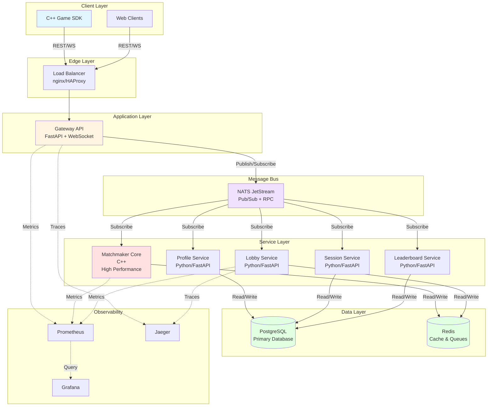
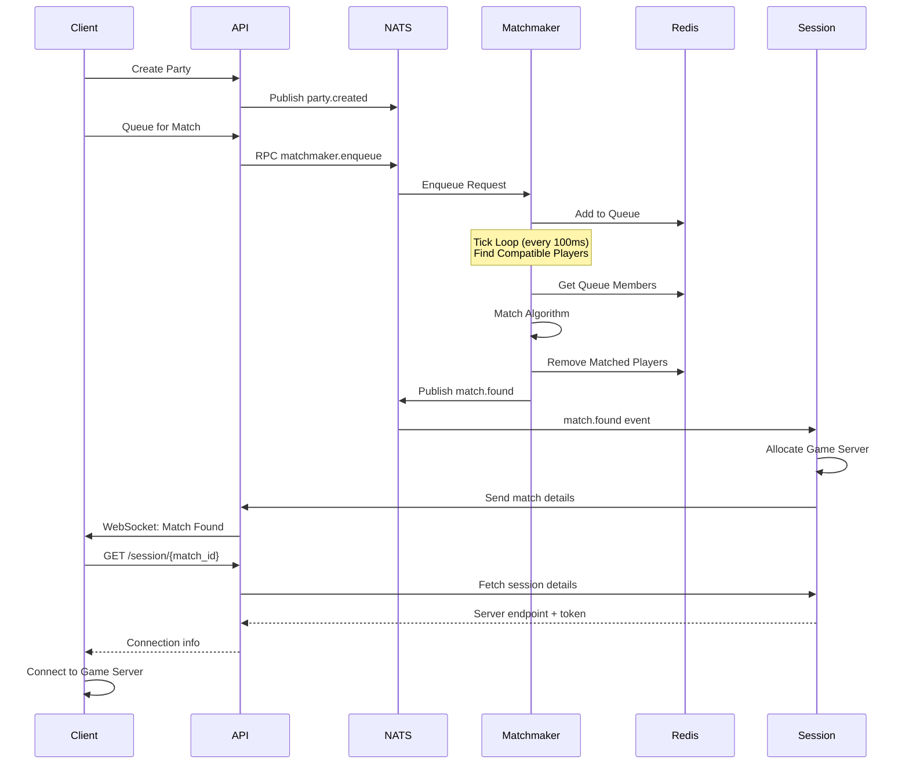
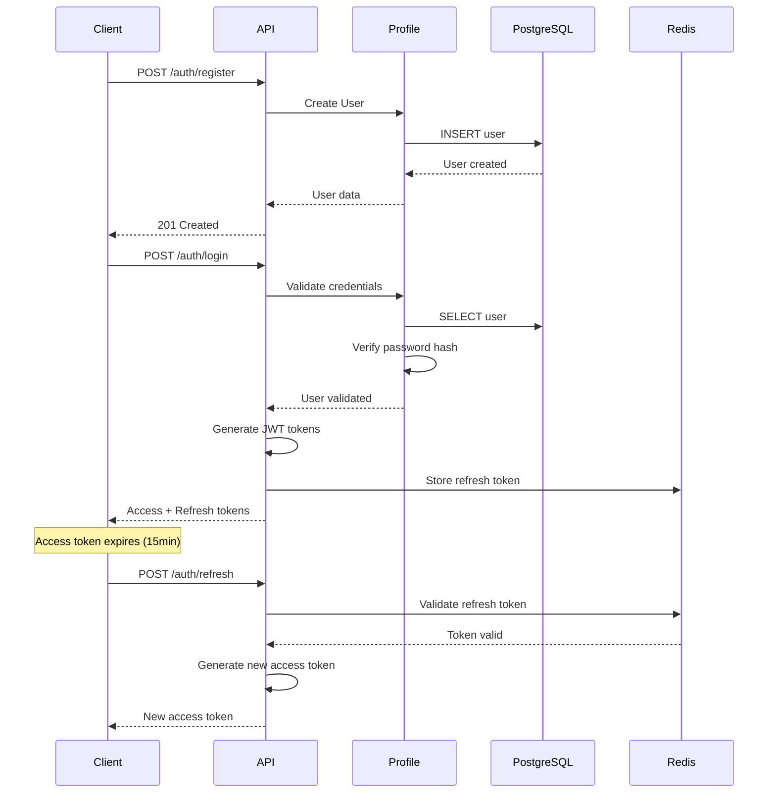

# Architecture Documentation

This document provides a comprehensive overview of the Matchmaker Platform architecture, design decisions, and system components.

## Table of Contents

- [System Overview](#system-overview)
- [Architecture Diagram](#architecture-diagram)
- [Components](#components)
- [Data Flow](#data-flow)
- [Design Decisions](#design-decisions)
- [Scalability](#scalability)
- [Security Architecture](#security-architecture)
- [Performance Considerations](#performance-considerations)

---

## System Overview

The Matchmaker Platform is a distributed microservices-based system designed for high-performance, real-time multiplayer game matchmaking. The architecture emphasizes:

- **Horizontal Scalability**: All services are stateless and can scale independently
- **Low Latency**: Critical path operations (matchmaking) use C++ for maximum performance
- **Real-time Communication**: WebSocket support for instant notifications
- **Fault Tolerance**: Service isolation prevents cascading failures
- **Observability**: Comprehensive metrics, traces, and logs

---

## Architecture Diagram

### High-Level Architecture

### Matchmaking Flow

### Authentication Flow

---

## Components

### 1. Gateway API (FastAPI)

**Responsibilities**:
- HTTP/REST endpoint exposure
- WebSocket connection management
- JWT authentication & validation
- Rate limiting (Redis-backed)
- Request routing to NATS services

**Technology Stack**:
- Python 3.11+ with FastAPI
- Uvicorn ASGI server
- PyJWT for token handling
- Redis for rate limiting

**Scaling**: Horizontally scalable (stateless)

---

### 2. Matchmaker Core (C++)

**Responsibilities**:
- High-performance tick-based matchmaking (100ms ticks)
- Queue management by region/mode/team size
- MMR-based player matching
- Team balancing algorithm
- Match quality scoring

**Technology Stack**:
- C++17
- Redis for queue storage
- NATS for event publishing

**Algorithm Overview**:
1. **Queue Bucketing**: Players grouped by region, mode, and team size
2. **Dynamic MMR Widening**: Search range expands over time (100 → 500 MMR over 40s)
3. **Greedy Team Formation**: Minimize MMR variance within teams
4. **Quality Scoring**: Calculate match fairness (0.0-1.0)

**Performance**:
- Handles 10,000+ concurrent players
- <100ms p99 matching latency
- <30s average time to match

**Scaling**: Can run multiple instances with Redis-based queue coordination

---

### 3. Lobby Service (Python)

**Responsibilities**:
- Party creation and management
- Member join/leave operations
- Ready check coordination
- Queue entry validation

**Technology Stack**:
- Python 3.11+ with FastAPI
- Redis for party state
- NATS for event communication

**Scaling**: Horizontally scalable (stateless, Redis state)

---

### 4. Profile Service (Python)

**Responsibilities**:
- User authentication
- Profile management
- MMR tracking
- Stats aggregation

**Technology Stack**:
- Python 3.11+ with FastAPI
- PostgreSQL for persistent storage
- Bcrypt for password hashing

**Scaling**: Horizontally scalable (database is bottleneck)

---

### 5. Session Service (Python)

**Responsibilities**:
- Game server allocation
- Session lifecycle management
- Heartbeat monitoring
- Match result processing

**Technology Stack**:
- Python 3.11+ with FastAPI
- PostgreSQL for session state
- NATS for event communication

**Scaling**: Horizontally scalable (stateless)

---

### 6. Leaderboard Service (Python)

**Responsibilities**:
- Seasonal rankings
- Match history storage
- Stats queries and aggregation

**Technology Stack**:
- Python 3.11+ with FastAPI
- PostgreSQL with optimized indexes

**Scaling**: Horizontally scalable (read replicas for queries)

---

### 7. NATS Message Bus

**Purpose**: Decoupled asynchronous communication between services

**Features Used**:
- **Request-Reply RPC**: Synchronous service calls
- **Publish-Subscribe**: Event broadcasting
- **JetStream**: Persistent message streams (future)

**Message Patterns**:
- `matchmaker.enqueue` - RPC call to add player to queue
- `match.found` - Event when match is created
- `party.created`, `party.updated` - Party lifecycle events

**Scaling**: NATS cluster for high availability

---

### 8. Data Stores

#### PostgreSQL
- **Purpose**: Primary relational data store
- **Schema**: Isolated schemas per service (game.profile, game.session, etc.)
- **Tables**: Users, matches, match_history, sessions, leaderboards
- **Scaling**: Read replicas, connection pooling (PgBouncer)

#### Redis
- **Purpose**: High-speed cache and queue storage
- **Use Cases**:
  - Matchmaking queues
  - Party state
  - Rate limiting counters
  - Session tokens
- **Data Structures**: Hash sets, sorted sets, strings
- **Scaling**: Redis Cluster or Redis Sentinel

---

## Data Flow

### Match Creation Flow

1. **Client** creates party via Gateway API
2. **Gateway** validates JWT, forwards to Lobby Service via NATS
3. **Lobby Service** creates party state in Redis
4. **Client** sets ready status
5. **Client** queues party for match
6. **Gateway** validates all members ready, calls Matchmaker via NATS RPC
7. **Matchmaker** adds party to appropriate queue bucket in Redis
8. **Matchmaker tick loop** runs continuously:
   - Fetch queued players from Redis
   - Run matching algorithm
   - Form teams
   - Remove matched players from queue
9. **Matchmaker** publishes `match.found` event to NATS
10. **Session Service** receives event, allocates game server
11. **Gateway** forwards match info to clients via WebSocket
12. **Clients** connect to game server

### MMR Update Flow

1. **Game Server** sends match result to Session Service
2. **Session Service** validates server token
3. **Session Service** stores match history in PostgreSQL
4. **Session Service** publishes `match.completed` event
5. **Profile Service** receives event
6. **Profile Service** calculates MMR changes (Elo-style)
7. **Profile Service** updates user MMR in PostgreSQL
8. **Leaderboard Service** receives event
9. **Leaderboard Service** updates seasonal rankings

---

## Design Decisions

### Why C++ for Matchmaker?

**Reasoning**:
- Matchmaking is compute-intensive (O(n²) worst case)
- Needs to process 10,000+ players in <100ms
- Python's GIL limits performance
- C++ provides 10-100x better throughput

**Tradeoffs**:
- More complex to develop and maintain
- Longer build times
- Worth it for critical performance path

---

### Why NATS over Kafka/RabbitMQ?

**Advantages**:
- Simple RPC pattern (request-reply)
- Low latency (<1ms)
- Built-in clustering
- Easy to operate

**Tradeoffs**:
- Less mature ecosystem than Kafka
- Fewer stream processing features (JetStream adds this)

---

### Why Redis for Queues?

**Advantages**:
- In-memory performance (<1ms operations)
- Atomic operations for queue management
- TTL support for auto-cleanup
- Widely understood and supported

**Tradeoffs**:
- Data loss risk (mitigated with Redis persistence)
- Memory constraints (mitigated with eviction policies)

---

### Why PostgreSQL?

**Advantages**:
- ACID transactions
- Rich query capabilities
- JSON support (JSONB)
- Battle-tested reliability
- Excellent tooling

**Tradeoffs**:
- Vertical scaling limits (mitigated with read replicas)
- Slower than NoSQL for some workloads

---

## Scalability

### Current Capacity (Single Instance)

- **API Gateway**: 10,000 concurrent connections
- **Matchmaker**: 10,000 players, <30s match time
- **Database**: 10,000 writes/sec, 100,000 reads/sec
- **Redis**: 100,000 ops/sec

### Scaling Strategy

#### Horizontal Scaling
- **API Gateway**: Add instances behind load balancer
- **Services**: Add instances, NATS handles distribution
- **Matchmaker**: Run multiple instances with Redis coordination

#### Vertical Scaling
- **PostgreSQL**: Increase resources, add read replicas
- **Redis**: Increase memory, use Redis Cluster

#### Database Optimization
- Connection pooling (PgBouncer)
- Query optimization and indexing
- Read replicas for heavy read loads
- Partitioning for large tables (match_history)

#### Caching Strategy
- Redis cache for frequently accessed data
- CDN for static assets
- Edge caching for API responses (future)

---

## Security Architecture

### Authentication
- **JWT Tokens**: Short-lived access tokens (15min), long-lived refresh tokens (7d)
- **Password Hashing**: Bcrypt with salt
- **Token Storage**: Refresh tokens in Redis with TTL

### Authorization
- **Role-Based Access Control**: Future implementation
- **Resource Ownership**: Users can only access their own resources

### Network Security
- **HTTPS**: All external communication encrypted (TLS 1.3)
- **Internal Communication**: Consider TLS for service-to-service (future)
- **Firewall Rules**: Only Gateway API exposed externally

### Rate Limiting
- **Redis-based**: Token bucket algorithm
- **Per-User Limits**: 100 req/min (read), 30 req/min (write)
- **DDoS Protection**: Connection limits, request size limits

### Vulnerability Management
- **Dependency Scanning**: Trivy in CI/CD
- **Static Analysis**: Bandit for Python
- **Security Updates**: Automated Dependabot PRs

---

## Performance Considerations

### Latency Targets

| Operation | Target | p99 |
|-----------|--------|-----|
| API Request | <50ms | <100ms |
| Matchmaking | <30s avg | <60s |
| WebSocket Message | <10ms | <50ms |
| Database Query | <10ms | <50ms |

### Optimization Techniques

1. **Connection Pooling**: Reuse database connections
2. **Redis Caching**: Cache frequently accessed data
3. **Batch Operations**: Group database writes
4. **Async I/O**: Non-blocking operations (asyncio)
5. **C++ for Hot Path**: Matchmaker performance critical
6. **Database Indexes**: Optimize frequent queries
7. **Compression**: Reduce WebSocket message size

### Monitoring

- **Prometheus Metrics**: Request rates, latencies, error rates
- **Jaeger Traces**: End-to-end request tracing
- **Grafana Dashboards**: Real-time system health
- **Alerting**: PagerDuty integration for critical issues

---

## Future Improvements

### Phase 8 (Current)
- [ ] Complete observability stack (Prometheus, Grafana, Jaeger)
- [ ] Load testing suite (Locust)
- [ ] Chaos engineering tests

### Future Phases
- [ ] Geographic load balancing (multi-region)
- [ ] Voice chat integration
- [ ] Player reputation system
- [ ] Advanced anti-cheat integration
- [ ] Machine learning for match quality prediction
- [ ] GraphQL API alternative
- [ ] Service mesh (Istio/Linkerd)

---

## References

- [PHASES.md](../PHASES.md) - Development roadmap
- [API.md](API.md) - API documentation
- [CONTRIBUTING.md](../CONTRIBUTING.md) - Development guidelines
- [C++ SDK Documentation](../sdk/cpp/USAGE.md)
